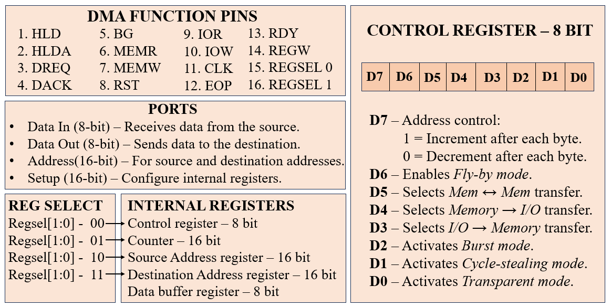
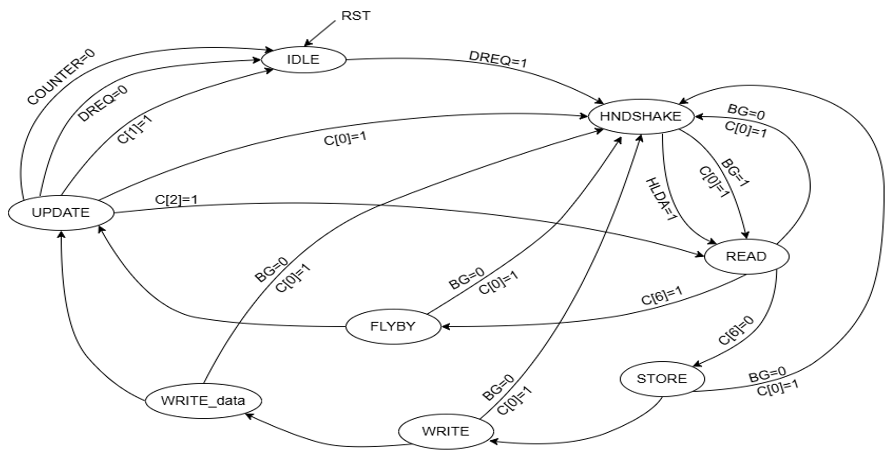
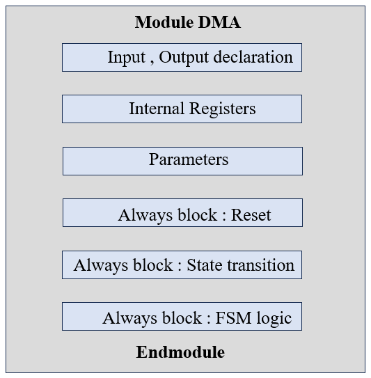
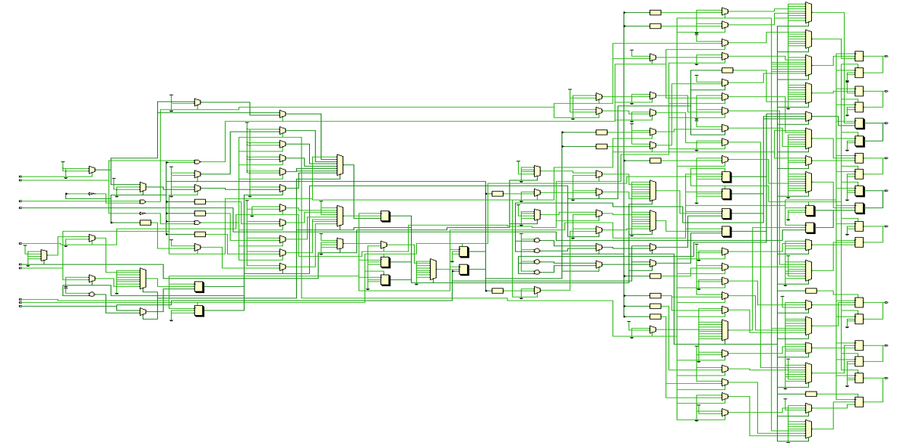

 ---
# Design and Simulation of a Simplistic Direct Memory Access (DMA) Controller using Verilog HDL

This work was undertaken as a part of Engineering mini project for 5th semester.The project focuses on implementing a simplistic DMA controller using Verilog HDL, demonstrating how data transfers occurs without CPU involvement. It includes detailed RTL design, testbenches, simulation results, and explanatory notes to help understand the working principle of the DMA controller.  

---  
# Table of Contents 
 - [Abstract](#abstract)
 - [Introduction](#introduction)
 - [Project Objectives](#project-objectives)
 - [System Overview](#system-overview)
 - [System Architecture Design](#system-architecture-design)
 - [Finite State Machine (FSM) Modeling](#finite-state-machine-fsm-modeling)
 - [Verilog Implementation](#verilog-implementation)
 - [Simulation Results](#simulation-results)
 - [Advantages](#advantages)
 - [Limitations](#limitations)
 - [Applications](#applications)
 - [Future Scope](#future-scope)
 - [Conclusion](#conclusion)
 - [References](#references)
---
# Abstract  

A DMA controller facilitates direct data transfers between memory and peripheral devices or between memory blocks without continuous CPU intervention, thereby reducing processor overhead and improving system 
efficiency. The design is structured around a finite state machine (FSM) that manages control signals, data requests, and acknowledgments to ensure accurate and synchronized transfers. The controller supports 
memory-to-peripheral, peripheral-to-memory, and memory-to-memory data transfers, providing flexibility for various system requirements. This project primarily focuses on RTL design, with minimal verification 
performed using simple testbenches to validate basic data transfer functionality.  

 - The entire RTL design, simulation, and analysis were carried out using the **Xilinx Vivado Tool**.

---
# Introduction  
In modern digital systems, data transfer between memory and peripheral devices is a critical operation. Traditionally, the CPU handles all data transfers, reading from the source and writing to the destination. While this approach is straightforward, it consumes significant processor time, reduces system efficiency, and increases latency for other tasks.   

A Direct Memory Access (DMA) Controller addresses this problem by enabling direct data transfer between memory blocks or between memory and peripheral devices without continuous CPU intervention. The DMA controller takes over the data bus temporarily, performs the transfer autonomously, and signals the CPU only when the operation is complete. This mechanism reduces CPU load, allowing it to execute other instructions while the data transfer occurs in parallel.

The primary function of a DMA controller is to manage data transfer requests, control signals, and handshaking between the source and destination. In this project, the DMA controller is designed in Verilog HDL, incorporating a finite state machine (FSM) to handle all control operations. The design supports multiple transfer types, including:

- Memory-to-Peripheral
- Peripheral-to-Memory
- Memory-to-Memory

This project emphasizes RTL design, focusing on the structural and functional aspects of the DMA controller. Minimal verification has been performed using simple testbenches to validate basic transfer functionality. The resulting design provides a clear understanding of the internal working and control mechanism of a DMA controller at the RTL level.
### CPU-Driven vs DMA-Driven Transfers

| Feature             | CPU-Driven Transfer                  | DMA-Driven Transfer                               |
| ------------------- | ------------------------------------ | ------------------------------------------------- |
| **CPU Involvement** | CPU reads and writes every data word | CPU only configures the DMA, the DMA handles the rest |
| **Processor Load**  | High                                 | Low                                               |
| **Transfer Speed**  | Slower, depends on CPU               | Faster and more efficient                         |
| **Use Case**        | Small or infrequent transfers        | Large or continuous transfers                     |

--- 
# Project Objectives
1. To understand the working principle and internal operation of a Direct Memory Access (DMA) controller.
2. To design and implement a basic DMA controller using Verilog HDL with FSM-based control logic.
3. To simulate, verify, and validate the design using appropriate testbenches and waveform analysis.
4. To gain practical exposure to modular RTL design, signal behavior, and digital system debugging techniques.
---  
# System Overview 
   

The DMA controller is implemented as a fully synchronous single-channel system designed to 
handle data transfers between memory and peripheral devices with minimal CPU involvement. 
All operations are synchronized using a single, stable clock source to ensure reliable timing 
and deterministic behavior. Configuration of the controller is achieved through an 8-bit control 
register, enabling software-driven selection of operational modes, transfer direction, addressing 
style, and optional fly-by functionality.   

The design supports three distinct transfer modes—Burst, Cycle-Stealing, and 
Transparent—allowing the system to optimize throughput, minimize bus contention, or 
leverage idle cycles depending on the application. Furthermore, the controller is capable of 
operating in three transfer directions: Memory ↔ I/O, I/O → Memory, and
Memory → Memory, providing flexibility for both processor-based and SoC-based 
architectures.   

An additional Fly-by mechanism allows data to be forwarded directly between source and 
destination during transfers, reducing buffering requirements and improving latency 
performance. The architecture is modular with well-defined interfaces, enabling easy 
integration into larger processor subsystems while supporting deterministic and programmable 
data handling.  

---
# System Architecture Design 

The image below provides a visual overview of the DMA controller’s internal organization.   

  

## Ports 
 - **Data In (8-bit)** — Input to DMA. Carries data read from source (memory or I/O). On a 
MEMR or IOR cycle the device places data on this bus and DMA samples it (usually into 
a data buffer). 
 - **Data Out (8-bit)** — Output from DMA. Holds data to be written to memory or I/O when 
MEMW / IOW is asserted. 
 - **Address (16-bit)** — Output from DMA. Carries source or destination addresses during 
read/write phases. DMA drives the address bus according to which phase it’s in (read phase 
uses source address; write phase uses destination address). 
 - **Setup (16-bit)** — Input bus used by CPU to program internal registers. When REGW is 
asserted with a chosen REGSEL, the Setup value is latched into that internal register.

## DMA Function Pins  
These are the control, status and bus-control signals the DMA uses to interact with CPU, 
memory and peripherals: 
1. **HLD (Hold)** — Output (from DMA to CPU) 
DMA asserts HLD to request control of the system bus (address/data/control lines). It 
means “please let me take the bus”. 
2. **HLDA (Hold Acknowledge)** — Input (from CPU) 
CPU asserts HLDA to indicate it has relinquished the bus and DMA may start using it 
(acknowledges the hold request). 
3. **DREQ (DMA Request)** — Input (from peripheral) 
Peripheral asserts DREQ to ask the DMA to perform a transfer. This is the usual transfer 
trigger. 
4. **DACK (DMA Acknowledge)** — Output (from DMA) 
DMA asserts DACK to acknowledge it received DREQ and is ready/performing transfer. 
5. **BG (Bus Grant)** — Input 
Alternative bus grant signal (used in BG-based/transparent modes). When BG is asserted 
the arbiter says DMA may use the bus. 
6. **MEMR (Memory Read)** — Output 
Asserted when DMA reads from system memory (places address on Addrbus, asserts 
MEMR and samples Data_in). 
7. **MEMW (Memory Write)** — Output 
Asserted when DMA writes to system memory (places address on Addrbus, drives 
Data_out, and pulses MEMW to write). 
8. **RST (Reset)** — Input 
Synchronous/asynchronous reset that clears internal registers, state machine, outputs and 
returns DMA to IDLE. 
9. **IOR (I/O Read)** — Output 
Asserted when DMA reads from an I/O device (used instead of MEMR for I/O-mapped 
devices). 
10. **IOW (I/O Write)** — Output 
Asserted when DMA writes to an I/O device (used instead of MEMW for I/O-mapped 
devices). 
11. **CLK (Clock)** — Input 
System clock for FSM, register updates and synchronous logic. 
12. **EOP (End Of Process)** — Output 
Asserted when DMA completes the requested transfer (counter reaches zero or DREQ de
asserts). Useful for CPU interrupts or status. 
13. **RDY (Ready)** — Input 
Indicates target memory/I/O is ready for data; DMA should check RDY before 
sampling/writing to ensure stable transfer. 
14. **REGW (Register Write)** — Input 
When REGW is asserted, the value on Setup[15:0] is written into the internal register 
selected by REGSEL. 
15. **REGSEL0 (bit 0)** — Input 
Register select LSB — together with REGSEL1 chooses which internal register to write. 
16. **REGSEL1 (bit 1)** — Input 
Register select MSB — with REGSEL0, selects Control / Counter / Source / Destination 
for REGW.

## Internal Registers  
 - **Control register (8-bit)** — central configuration byte controlling mode and behavior. It 
contains bits described below (D7..D0). This register determines transfer type, mode 
(burst/cycle/transparent), fly-by enable, and address increment/decrement. 
 - **Counter (16-bit)** — holds remaining transfer length (usually number of 8-bit bytes). It 
decrements each completed transfer and when it reaches zero DMA asserts EOP. 
 - **Source Address register (16-bit)** — current read address. Updated after each read if 
increment/decrement enabled. 
 - **Destination Address register (16-bit)** — current write address. Updated after each write 
if increment/decrement enabled. 
 - **Data buffer register (8-bit)** — temporary storage between read and write phases (used 
when not in flyby mode). Ensures write data is stable and meets bus timing. 

## Register Selection  
When CPU wants to configure the DMA, it places a 16-bit value on the Setup bus and pulses 
REGW while setting REGSEL: 
 - 00 → Control register (only low 8 bits usually used, remaining bits ignored) 
 - 01 → Counter (16-bit) — number of bytes/words to transfer .
 - 10 → Source Address (16-bit) — starting address to read from .
 - 11 → Destination Address (16-bit) — starting address to write to.

## Control Register  
  
 - **C7 — Address control (Increment/Decrement)** 
    - 1 = increment source/destination addresses after each byte (typical for forward memory 
     copies). 
    - 0 = decrement addresses after each byte (useful for LIFO-like transfers or peripherals that 
require reverse order). 
 - **C6 — Fly-by enable**
When set, DMA attempts fly-by transfer: the data read from source is directly passed to 
the write phase (destination) without storing in the internal buffer. This reduces latency 
and buffer usage but requires that bus timing and device readiness allow back-to-back 
read/write. 
 - **C5 — Selects Mem ↔ Mem transfer (memory-to-memory)** 
When set, DMA configures both phases as memory operations (MEMR then MEMW) 
using source and destination addresses. 
 - **C4 — Selects Memory → I/O transfer** 
When set, the read phase uses MEMR and the write phase uses IOW (write to I/O 
device). 
 - **C3 — Selects I/O → Memory transfer** 
When set, read phase uses IOR (read from I/O device) and write phase uses MEMW. 
 - **C2 — Activates Burst mode** 
DMA holds the bus for the entire transfer block. Best throughput because DMA 
continuously reads/writes until Counter = 0. 
 - **C1 — Activates Cycle-stealing mode** 
DMA performs one transfer (read+write) and returns the bus to CPU, repeating when 
granted again. Allows CPU to run between transfers. 
 - **C0 — Activates Transparent mode** 
DMA only transfers while the Arbiter’s BG signal is asserted (when bus is free). If BG 
de-asserts mid-transfer, DMA cannot resume the interrupted transfer and will re-read 
previous data on next attempt (design limitation to be aware of).

---  

# Finite State Machine (FSM) Modeling  

The image below is the finite state machine representing the control flow of the DMA controller.   

  

1. **IDLE State** 
   - The controller remains inactive in this state. 
   - It continuously monitors the DMA request (DREQ) line. 
   - When request is detected, controller asserts the Hold signal to get control of the system bus  
   - After initiating the hold request, the controller proceeds to the Handshake state. 
 
2. **HNDSHAKE (Handshake) State** 
   - In this state, the DMA controller performs and register initialization. 
   - It waits for the CPU to acknowledge the hold request through Bus Grant (BG) or Hold 
   Acknowledge (HLDA) signals. 
   - The controller also allows programming of internal registers such as the control, source, 
   destination, and counter registers. 
   - Once bus ownership is granted and the device is ready, the controller asserts DMA 
   Acknowledge (DACK) and proceeds to the Read state.

3. **READ State** 
   - The DMA controller reads data from the source location, which can be either memory or 
  an I/O device. 
   - The source address is placed on the address bus, and the appropriate read signal (MEMR 
  or IOR) is activated. 
   - If fly-by mode is enabled, the data is directly transferred to the destination without 
  buffering, otherwise, the data is temporarily stored in an internal buffer. 
   - After completion, the controller transitions to either the Flyby or Store state based on the 
  mode setting. 
 
4. **STORE State*** 
   - The data read from the source is latched into an internal data buffer register. 
   - All read control signals are deactivated to complete the read phase. 
   - The controller then prepares to perform the write operation and moves to the Write state. 

5. **WRITE State** 
   - The DMA controller sets up the destination address and prepares the data for transfer. 
   - It places the destination address on the address bus and loads the buffered data onto the 
data bus. 
   - This is a preparatory phase before the actual write occurs. 
   - The controller then proceeds to the Write_data state. 
 
6. **WRITE_data State** 
   - In this state, the actual data transfer to the destination is carried out. 
   - The controller asserts the required write control signal (MEMW or IOW) to perform the 
  write operation. 
   - After completing the data write, the controller proceeds to the Update state. 
 
7. **FLYBY State** 
   - This state supports direct data transfer between source and destination without a buffer. 
   - Both read and write operations occur almost simultaneously, improving transfer speed. 
   - After the fly-by transfer, the controller moves to the Update state. 
 
8. **UPDATE State** 
   - The DMA controller updates its internal registers after each transfer. 
   - The source and destination addresses are incremented or decremented depending on the 
   direction bit in the control register. 
   - The transfer counter is decremented to track remaining data words. 
   - If all data has been transferred, the End of Process (EOP) signal is asserted, and bus control 
   is released. 
   - Otherwise, the controller returns to the Read or Handshake state for the next transfer 
   cycle.

---  

# Verilog Implementation  

The following diagram illustrates the flow of the DMA module as implemented using Verilog in behavioural description.   

      

The DMA controller is implemented using a behavioural modeling approach in Verilog, focusing on describing the functional operation rather than gate-level details. The module begins with input–output declarations followed by internal registers and parameter definitions used for state encoding. The control mechanism is implemented through sequential always blocks that handle reset logic, state transitions, and the main FSM behaviour. Each state in the FSM governs signal activation, address updates, and data-transfer control, making the design modular and easy to simulate. This behavioural description allows clear visibility of system operation and simplifies verification through testbenches.    

The image below is the RTL schematic generated from the Verilog design, illustrating the internal logic connections.  

  

---  
# Simulation Results    
The DMA controller was verified through twelve simulation testbenches, each targeting a specific transfer mode and ensuring data transfer behaviour. 
The simulation environment initializes the DMA through a reset sequence, loads configuration values into internal registers, and then triggers the corresponding transfer operation.  

The modes tested include:
   - I/O Device To Memory - Burst Mode
   - I/O Device To Memory - Burst Mode - Flyby
   - I/O Device To Memory - Cycle Stealing Mode
   - I/O Device To Memory - Transparent Mode
   - Memory To I/O Device - Burst Mode
   - Memory To I/O Device - Cycle Stealing Mode
   - Memory To I/O Device - Cycle Stealing Mode - Flyby
   - Memory To I/O Device - Transparent Mode
   - Memory To Memory - Burst Mode
   - Memory To Memory - Cycle Stealing Mode
   - Memory To Memory - Transparent Mode
   - Memory To Memory - Transparent Mode - Flyby

1. **Burst Mode** 
    - DMA takes full control of the bus and performs continuous uninterrupted transfers.
    - Operates until the programmed byte/word count is completed.
    - Provides the highest throughput but temporarily blocks CPU bus access.
    - Can be used for Memory-to-Memory, Memory-to-I/O, and I/O-to-Memory transfers.

2. **Cycle Stealing Mode**
   - DMA transfers one byte/word at a time, briefly stealing the bus for each transfer.
   - After every transfer, control is immediately returned to the CPU.
   - Minimizes CPU stalls while still supporting background transfers.
   - Works for Memory-to-Memory, Memory-to-I/O, and I/O-to-Memory operations.

3. **Transparent Mode**
   - DMA operates only when the bus is idle, i.e., when the CPU is not using it.
   - Controlled by the Bus Grant (BG) signal from the CPU/bus arbiter.
   - Ensures zero interference with CPU execution but offers lower throughput.
   - Suitable for Memory-to-Memory, Memory-to-I/O, and I/O-to-Memory transfers.

 
4. **Flyby Mode** (Enhancement applicable to any mode above)
    - Data bypasses internal DMA data registers and moves directly between source and destination.
    - Reduces latency and increases transfer speed for specific scenarios.
    - Can be combined with Burst, Cycle Stealing, or Transparent modes.
    - Supported for Memory-to-Memory, Memory-to-I/O, and I/O-to-Memory operations.

## I/O Device To Memory - Burst Mode 

## I/O Device To Memory - Burst Mode - Flyby 
 

## I/O Device To Memory - Cycle Stealing Mode  
 

## I/O Device To Memory - Transparent Mode  
 

## Memory To I/O Device - Burst Mode  
 

## Memory To I/O Device - Cycle Stealing Mode  
 

## Memory To I/O Device - Cycle Stealing Mode - Flyby  
 

## Memory To I/O Device - Transparent Mode  
 

## Memory To Memory - Burst Mode  
 

## Memory To Memory - Cycle Stealing Mode  
 

## Memory To Memory - Transparent Mode  
 

## Memory To Memory - Transparent Mode - Flyby  
   

---  
# Advantages  
 - **Reduced CPU Workload** : The CPU is freed from handling data transfers, allowing it to focus on critical tasks and improving overall performance.
 - **Higher Data Transfer Speed** : Transfers large blocks of data faster than CPU-driven methods, improving throughput in real-time systems.
 - **Efficient Memory and Peripheral Access** : Supports direct movement of data between memory and I/O, eliminating unnecessary intermediate operations.
 - **Improved System Responsiveness** : Enables smooth operation in applications like audio/video streaming, communication interfaces, and sensor acquisition.
 - **Flexible Transfer Modes** : User-selectable modes (burst, cycle stealing, transparent) allow optimization based on system requirement.
 - **Reduced Power Consumption** : By minimizing CPU intervention, the system can save power, especially useful in embedded and portable devices.

---
# Limitations  
 - **Ignored CPU Data Consistency** : Since DMA and CPU access memory independently, improper synchronization can lead to data inconsistency or corruption.
 - **Complexity in Debugging** : Debugging DMA operations can be harder due to multiple states, concurrent bus usage, and indirect data flow.
 - **Requires Additional Hardware** : DMA adds extra circuitry and control logic, increasing system cost, size, and design complexity.
 - **Priority and Arbitration Issues** : In multi-device systems, DMA may block or delay CPU access to memory, affecting real-time response if not managed properly.
 - **Limited Address and Data Widths** : DMA transfer size and addressing capability depend on the hardware structure; large memory systems may need multi-channel DMA.
---
# Applications  
 - **Microcontroller-Based Embedded Systems** : Used to transfer data between memory and I/O peripherals without CPU involvement, improving speed and reducing CPU workload.
 - **Data Transfer in Communication Systems** : Used in UART, SPI, I2C, and Ethernet interfaces for fast streaming of data between buffers and peripheral blocks.
 - **Audio and Video Processing Units** : Enables continuous transfer of audio/video frames from memory to DAC/ADC modules for uninterrupted playback or recording.
 - **Sensor Data Acquisition in IoT Devices** : Used in devices like STM32, ESP32, etc., to continuously transfer sensor data to memory for processing.
 - **Memory-to-Memory Transfers in Processors** : Used for large block data movement such as buffering, copying, or updating memory based datasets. 
 - **Data Logging Devices and Storage Systems** : Transfers data from RAM to storage memory (Flash/SD card) efficiently.
---
# Future Scope
 - **Multi-Channel Expansion** : The design can be upgraded to support multiple DMA channels to handle simultaneous data transfers between several peripherals.
 - **Advanced Priority Arbitration** : Implementing priority-based channel arbitration allows efficient handling of time-critical transfers in multi-source systems.
 - **AXI/AHB/PCI Interface Compatibility** : Extending the DMA to support standardized on-chip bus protocols enables integration in real SoC/processor platforms.
 - **Physical Design and ASIC Implementation** : Further work may include backend flow such as synthesis, floorplanning, clock tree design, placement-routing, and timing closure.
 - **Error Detection and Handling** : Enhancing the system with parity checking or CRC ensures reliable data transfers in noisesensitive environments.
---
# Conclusion  
 - The designed DMA controller successfully automates data transfer between memory and peripherals without burdening the CPU.
 - Verilog HDL implementation provides modularity, scalability, and reusability for future digital system enhancements.
 - Simulation results validate proper operation of transfer modes, address updates, data buffering, and register control.
 - Integration of burst, cycle stealing, and transparent modes offers flexibility for a wide range of system applications.
 - The overall design improves system throughput and efficiency while maintaining reliable data transfer.
 - The project demonstrates practical exposure to digital design, FSM implementation, and hardware verification methodologies.
---  
# References  
 - [VLSI Implementation of Direct Memory Access DMA Controller](https://www.jetir.org/view?paper=JETIR1807153)
 - [Design of DMA Controller Using Verilog HDL](https://www.ijrti.org/papers/IJRTI2305073.pdf)
 - [A Review Paper on Design of DMA Controller Using VHDL](https://ijirt.org/publishedpaper/IJIRT100876_PAPER.pdf)
 - [Design and Implementation of an Efficient DMA Controller with Error Detection for Embedded Systems](https://www.nielit.gov.in/aurangabad/sites/default/files/Aurangabad/Design_and_Implementation_of_an_Efficient_DMA_Controller_with_Error_Detection_for_Embedded_Systems.pdf)

---  
# Team Members
1. Rachith H
2. Sakshi Wali
3. Ratan Shantaraj Gowda
4. Priya Patel SG
